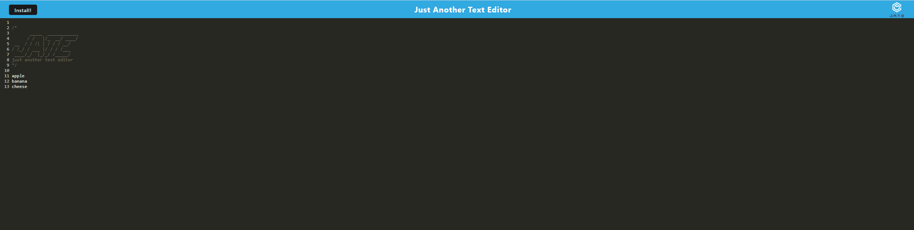
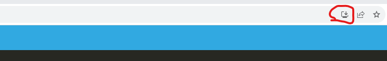

# Text Editor Starter Code
# Social-Network-API 

# Table of Contents
- [Description](#description)
- [Installation](#installation)
- [Usage](#usage)
- [License](#license)
- [Contribution](#contribution)
- [Tests](#test)
- [Questions](#questions)

## Description:
This application is a simple but efficient text editor, where you can write down all your notes! 

## Installation:

You can either install this application and run it on your local host (explained below), or you are able to use it via Heroku: https://p-h-davies-text-editor-5135231fbfde.herokuapp.com/

To install this application and run it on your local host, you will need to:
- Ensure you have a Terminator emulator Software installed (such as Terminal for Mac, or Bash for Windows). 
- Ensure you have a code editor, such as VSCode.

## Usage:
If you are just using this application on Heroku, all you need to do is start typing into the text field - it will save your notes for you automatically. If you'd like to install this application onto your desktop, you just need to click the install button:

**If you are installing this application to run on your local host, you'll need to follow these instructions**:

After cloning this code, you will need to navigate to the folder in your chosen terminal application and run two commands:
- npm run install
- npm run start

After this, a port will open (PORT: 8080), and you'll be able to use the application by navigating to http://localhost:8080/ in your browser. 

Once you've arrived at the application on a browser, write into the text area and it'll save what you've written - it's that simple! If you'd like to install this application onto your desktop, you just need to click the install button (image shown previously)

## License:
The license for this project is: No_License.
This project has not been listed under a license.

## Contribution:
N/A

## Test:
N/A

## Questions
My GitHub username is p-h-davies, and you can view my profile here: https://github.com/p-h-davies/.
 
To get in contact with me, please email me here: philippadavies603@gmail.com.

